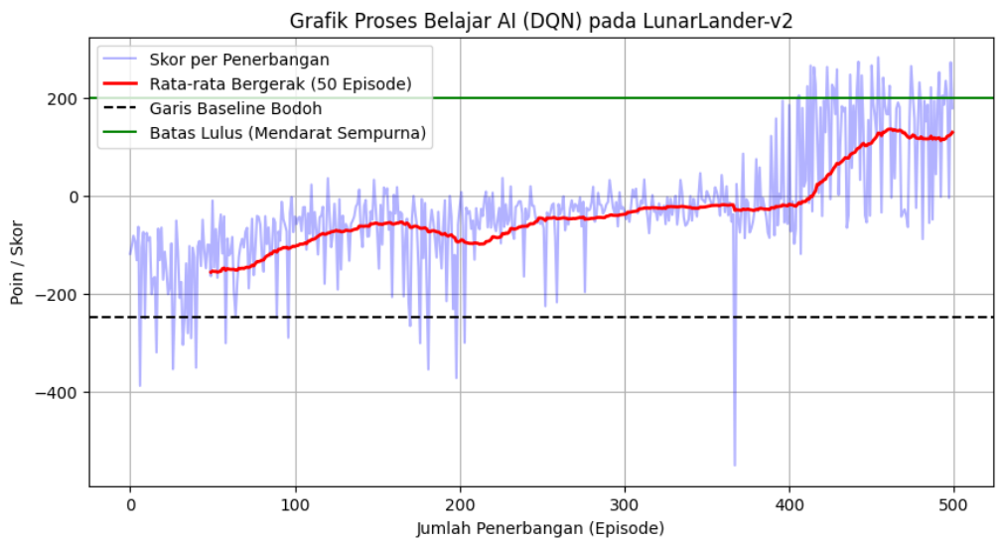

# Optimisasi Pendaratan Wahana Antariksa (LunarLander-v3) Menggunakan Deep Q-Network (DQN) 🚀

Repositori ini berisi kode sumber untuk Proyek Tugas Akhir Mata Kuliah Kecerdasan Buatan (Semester Genap 2025/2026) Departemen Teknik Komputer, Universitas Indonesia.

## 👥 Kelompok 1
* Alfonsus Tanara Gultom (2306267126)
* Farhan Ramadhani Zakiyyandi (2306220412)
* Naufal Febriyanto (2106702674)
* Filaga Tifira Muthi (2306280445)

## 📌 Deskripsi Proyek
Proyek ini mengimplementasikan metode **Reinforcement Learning** menggunakan algoritma **Deep Q-Network (DQN)** untuk menyelesaikan masalah navigasi pendaratan pada environment `LunarLander-v3` dari *Gymnasium*. Agen AI dilatih untuk menyeimbangkan wahana antariksa, menghemat bahan bakar, dan mendarat dengan aman di koordinat target (0,0).

## 📊 Hasil Eksperimen
Agen AI kami dilatih selama 500 episode. Terdapat peningkatan signifikan dibandingkan model *Random Baseline*:
* **Skor Baseline (Random Policy):** -248.56 (Sering meledak/jatuh)
* **Skor Akhir DQN (Episode 500):** +129.45 (Berhasil mendarat dengan aman)

## ⚙️ Cara Menjalankan Kode (Reproduksibilitas)
Cara paling mudah untuk mereproduksi hasil kami adalah melalui Google Colab:
1. Buka folder `notebooks/` di repositori ini.
2. Buka file `LunarLander_DQN_Kelompok1.ipynb` menggunakan Google Colab.
3. Pastikan *Runtime* diatur ke **T4 GPU** (`Runtime` -> `Change runtime type`).
4. Jalankan sel secara berurutan (*Run All*). Proses instalasi Box2D dan training memakan waktu sekitar 15 menit.

## 🗂 Struktur Repositori
* `notebooks/` : Berisi source code utama berupa Jupyter Notebook.
* `models/` : Berisi file `.pth` (bobot model/weights) hasil training DQN.
* `assets/` : Berisi aset visualisasi dan grafik hasil eksperimen.
* `metadata.json` : Deklarasi kontribusi anggota kelompok sesuai standar tugas.